<h2 align="center">About me</h2>

- 🌱 I'm always looking to learn something new, whether it's a language, a framework, or just a better way to write code.
- 🎯 My goal is to become a full-stack developer and keep growing in the tech world.
- 🤝 I enjoy working in team, sharing knowledge and learning from others.
- 🎮 When I'm not coding, you'll probably find me gaming or playing soccer.
- 📍 Based in Colombia, open to remote opportunities.

 

<h2 align="left">🛠️ Tech Stack & Skills</h2>

  <b>Backend:</b> 
  
  
  

  <b>Frontend:</b> 
  
   

  <b>Database:</b> 
  
  

  <b>Technologies:</b> 
  
  
  

<h2 align="left">🚀 Featured Projects</h2>

<table>
  <tr>
    <td width="33%" valign="top">
      
      <h3>Simulador de Gasto Diario</h3>
      
El Simulador de Gasto Diario es una herramienta de consola sencilla que permite registrar y categorizar gastos personales en un archivo JSON, resolviendo la falta de un control financiero práctico y dinámico sin las complicaciones de las aplicaciones avanzadas.

      
    </td>
      <td width="33%" valign="top">
      
      <h3>DevQuote UI</h3>
      
Este proyecto es una interfaz web interactiva en HTML5 y CSS3 nativo que simula el proceso de cotización de software, resolviendo la falta de herramientas visuales claras y accesibles para que emprendedores y empresas estimen costos de desarrollo sin complicaciones.

      
   
    </td>
    <td width="33%" valign="top">
      
      <h3>Plataforma para exámenes – Acme School</h3>
      
Acme School Exams es una plataforma web desarrollada en JavaScript con gestión privada de usuarios y exámenes, y un módulo público interactivo con temporizador en tiempo real, resolviendo la necesidad de la escuela Acme de automatizar la evaluación en línea y centralizar la administración académica de forma intuitiva sin depender de un servidor externo.

      
      
      
    </td>
  </tr>
</table>

<h2 align="left">CV/Resume</h2>

  

<h2 align="left">How to reach me</h2>
 miguel.angelfr114@gmail.com

 322 742 4793

---

